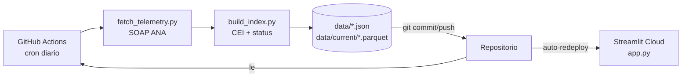

# 🌊 RS River Monitor

Painel online de **monitoramento diário das estações fluviométricas da ANA** no Rio
Grande do Sul. Cada estação é avaliada **apenas contra o seu próprio histórico** de até
90 temporadas — sem benchmark externo, sem parâmetros comerciais.

<!-- Substitua USER/REPO pelo seu usuário/repositório -->

[](https://SEU-APP.streamlit.app)

> **App online:** https://SEU-APP.streamlit.app · **Atualizado 1×/dia via GitHub Actions**

---

## O que faz

- Acompanha **50 estações com telemetria em tempo real** (transmissão ~15 min via SOAP da ANA).
- Para cada estação calcula, comparando só com o passado dela mesma:
  - **status do valor diário** vs. percentis P90 / P97 / P99 da própria série;
  - **CEI** (*Cumulative Excess Index*) — soma dos excessos diários acima do limiar
    P97 durante o período de risco (1-out a 30-jun) — e o **rank percentil** desse CEI
    contra as temporadas passadas.
- Mapa de status, tabela ordenável e, por estação, dois gráficos: série da temporada vs.
  percentis próprios e curva de CEI acumulado vs. o envelope histórico.

## Como funciona (arquitetura)

O ETL é separado da visualização. Um workflow agendado busca os dados, recalcula o índice
e **commita os arquivos processados de volta no repositório**; o Streamlit apenas lê esses
arquivos. Sem servidor 24h, sem banco de dados, custo zero.



## Estrutura

```
rs-river-monitor/
├── .github/workflows/daily_update.yml   # cron diario (ETL + commit)
├── etl/
│   ├── seed_baseline.py    # bootstrap unico: gera data/baseline.json do historico
│   ├── fetch_telemetry.py  # busca telemetria ANA (roda todo dia)
│   └── build_index.py      # calcula CEI/status -> data/status.json
├── hydro.py                # logica hidrologica compartilhada (temporada, CEI, percentis)
├── stations.py             # as 50 estacoes monitoradas
├── app.py                  # dashboard Streamlit
└── data/
    ├── baseline.json       # percentis + envelope historico por estacao (commitado)
    ├── current/*.parquet   # temporada corrente, incremental (atualizado no cron)
    └── status.json         # snapshot lido pelo app
```

## O índice, em uma frase

> Para cada dia da temporada de risco, mede-se o quanto o rio passou do seu próprio
> limiar histórico (P97). A soma desses excessos é o CEI; comparado às temporadas
> passadas da estação, ele diz **quão excepcional está a temporada atual** — em termos
> da própria estação, não de um padrão externo.

## Rodando localmente

```bash
python -m venv .venv && source .venv/Scripts/activate   # Windows: .venv\Scripts\activate
pip install -r requirements.txt

# 1. (uma vez) gerar o baseline a partir de um historico ANA local
RIVERFLOW_DATA=/caminho/para/dados/ana python etl/seed_baseline.py

# 2. atualizar telemetria e indice
python etl/fetch_telemetry.py
python etl/build_index.py

# 3. abrir o dashboard
streamlit run app.py
```

> O `seed_baseline.py` só é necessário para (re)gerar o `data/baseline.json`. Uma vez
> commitado, o repositório é auto-suficiente: o cron diário só roda os passos 2 e 3.

## Deploy (grátis)

1. Suba o repositório no GitHub (com `data/baseline.json` e `data/current/` commitados).
2. Em **Settings → Actions → General**, garanta *"Read and write permissions"* para o
   `GITHUB_TOKEN` (o workflow commita os dados diários).
3. Em [share.streamlit.io](https://share.streamlit.io), conecte o repositório e aponte
   para `app.py`. O deploy é automático a cada push — incluindo os pushes diários do bot.

## Fonte dos dados

[ANA HidroWeb](https://www.snirh.gov.br/hidroweb/) e o serviço de telemetria SOAP
`telemetriaws1.ana.gov.br` (`DadosHidrometeorologicos`). Dados públicos.

---

*Projeto de portfólio. Não é recomendação operacional nem produto de seguro.*
